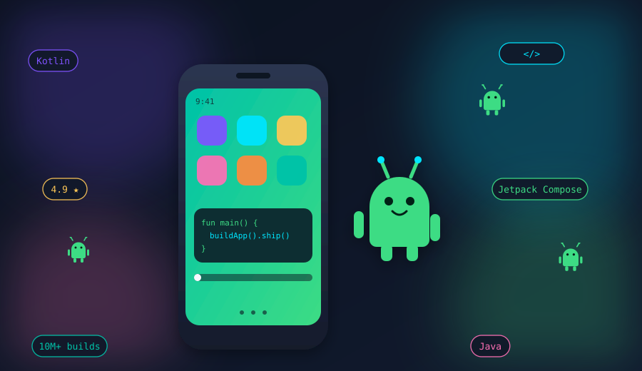

 

 

  

 

## 👋 About Me

- 🎓 **MCA Student** learning something new (and breaking something new) every day
- 💻 **Android Developer** — building with Java & Kotlin, bugs included, fixes guaranteed
- 🧠 Grinding **DSA** so future-me doesn't panic in interviews
- 📱 Turning coffee ☕ into **Jetpack Compose** screens
- 🐞 Breaking code daily, fixing it smarter the next day
- ✨ Let's build something awesome — and actually ship it

## 🌐 Let's Connect

## 🧰 Tech Stack

## 📊 GitHub Stats

## Done stalking ? Now go build something 👉

